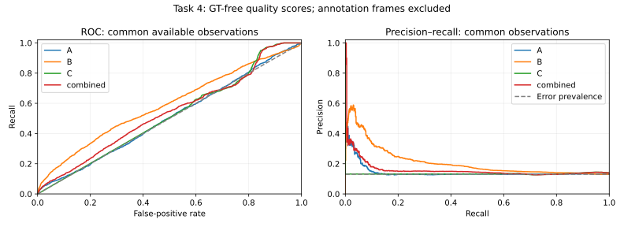

# Task 4 consolidated evaluation

Descriptive evaluation on one video and GT-assisted annotation experiment. No weights or thresholds were fitted.
Primary observations: 14175; GT present: 13068; GT absent: 1107.

Outcomes: {"acceptable_segmentation": 11485, "missing_visible_bird": 444, "segmentation_error": 1139, "false_positive_absent_bird": 586, "expected_empty": 521}

| Cohort | Signal | Available / cohort | ROC AUC | Average precision | Precision | Recall |
|---|---|---:|---:|---:|---:|---:|
| all_presence_aware | A | 14175 / 14175 | 0.584 | 0.254 | 0.454 | 0.213 |
| all_presence_aware | B | 13210 / 14175 | 0.590 | 0.208 | 0.485 | 0.009 |
| all_presence_aware | C | 13210 / 14175 | 0.514 | 0.133 | 0.129 | 0.686 |
| all_presence_aware | combined | 14175 / 14175 | 0.608 | 0.265 | unavailable | 0.000 |
| all_presence_aware | empty_baseline | 14175 / 14175 | 0.581 | 0.216 | 0.460 | 0.205 |
| common_available | A | 13210 / 13210 | 0.505 | 0.144 | 0.345 | 0.011 |
| common_available | B | 13210 / 13210 | 0.590 | 0.208 | 0.485 | 0.009 |
| common_available | C | 13210 / 13210 | 0.514 | 0.133 | 0.129 | 0.686 |
| common_available | combined | 13210 / 13210 | 0.536 | 0.159 | unavailable | 0.000 |
| common_available | empty_baseline | 13210 / 13210 | 0.500 | 0.131 | unavailable | 0.000 |

Precision/recall use the frozen thresholds in the protocol; they are not deployment recommendations.
Compare signals on common_available for equal coverage. Full-cohort results show missing B/C and practical coverage.
IoU averages/correlations use GT-present cases. Both-empty is expected absence, not IoU=1.
C is fixed-position overlap with the predicted annotation mask: legitimate bird movement can lower it.
Combined preserves the existing weights and legacy C=1 sentinel for small/empty masks; empty B uses the existing A/C fallback.
Empty-mask warnings are an explicit baseline. GT distinguishes expected absence from tracking failure during evaluation only.
No independent deployment validation or confidence interval treating adjacent frames as independent is claimed.

See signal_metrics.csv, threshold_sweep.csv and by_block_bird.csv for all cohorts and IoU=0.75 sensitivity.

